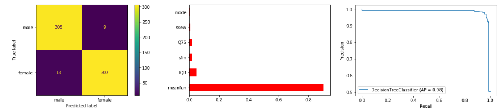
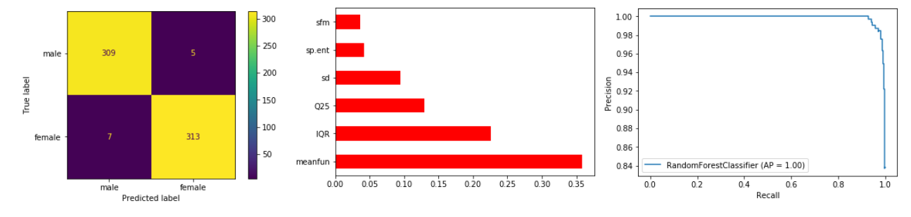
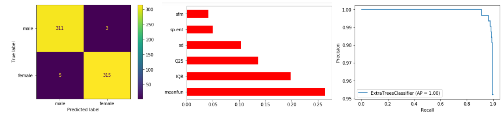
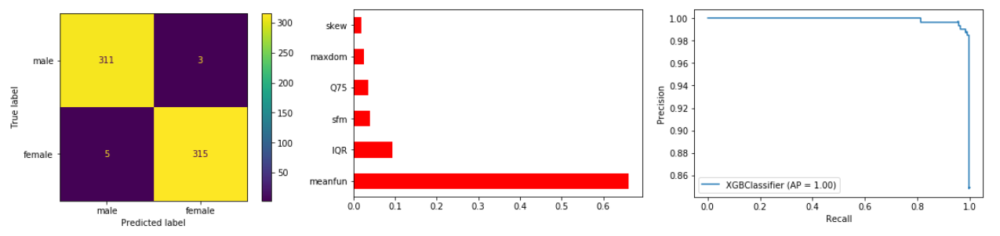

# Voice Gender Recognition

In this project it was used some different Machine Learning models to identify the gender of a voice (Female or Male) based on some specific speech and voice attributes.

### Models implemented by <a href="https://github.com/AnneLivia">Anne Livia</a>.

## Dataset Information:

- This dataset was obtained from Kaggle on <a href="https://www.kaggle.com/primaryobjects/voicegender"/> this link </a> by <a href="https://www.kaggle.com/primaryobjects"/>Kory Becker</a> and was created to identify a voice as male or female, based upon acoustic properties of the voice and speech. 
- The dataset consists of 3,168 recorded voice samples, collected from male and female speakers. The voice samples are pre-processed by acoustic analysis in R using the seewave and tuneR packages, with an analyzed frequency range of 0hz-280hz (human vocal range).

### Properties:

  - **meanfreq:** mean frequency (in kHz)
  - **sd:** standard deviation of frequency
  - **median:** median frequency (in kHz)
  - **Q25:** first quantile (in kHz)
  - **Q75:** third quantile (in kHz)
  - **IQR:** interquantile range (in kHz)
  - **skew:** skewness (see note in specprop description)
  - **kurt:** kurtosis (see note in specprop description)
  - **sp.ent:** spectral entropy
  - **sfm:** spectral flatness
  - **mode:** mode frequency
  - **centroid:** frequency centroid (see specprop)
  - **meanfun:** average of fundamental frequency measured across acoustic signal
  - **minfun:** minimum fundamental frequency measured across acoustic signal
  - **maxfun:** maximum fundamental frequency measured across acoustic signal
  - **meandom:** average of dominant frequency measured across acoustic signal
  - **mindom:** minimum of dominant frequency measured across acoustic signal
  - **maxdom:** maximum of dominant frequency measured across acoustic signal
  - **dfrange:** range of dominant frequency measured across acoustic signal
  - **modindx:** modulation index. Calculated as the accumulated absolute difference between adjacent measurements of fundamental ---- **frequencies divided by the frequency range
  - **label:** male or female

# Software Informations
  - Python
  - Scikit-learn
  - Matplotlib
  - Seaborn

# Trained Models 
  - <h3>Decision Tree Model</h3>
  
    - **Acurracy**: 0.9652996845425867
    - **Precision**: 0.9715189873417721
    - **Recall**: 0.959375
    - **F1-Score**: 0.9654088050314465
    - **Confusion Matrix, Feature Importance, and Precision-Recall Curve respectively**: 
    
      
      
  - <h3>Random Forest Model</h3>
  
    - **Acurracy**:  0.9810725552050473
    - **Precision**:  0.9842767295597484
    - **Recall**:  0.978125
    - **F1-Score**:  0.9811912225705329
    - **Confusion Matrix, Feature Importance, and Precision-Recall Curve respectively**: 
    
      
  
  - <h3>Extra Tree Model</h3>
  
    - **Acurracy**:  0.9873817034700315
    - **Precision**:  0.9905660377358491
    - **Recall**:  0.984375
    - **F1-Score**:  0.9874608150470221
    - **Confusion Matrix, Feature Importance, and Precision-Recall Curve respectively**: 
    
      
  
  - <h3>XGBoost model</h3>
  
    - **Acurracy**:  0.9873817034700315
    - **Precision**:  0.9905660377358491
    - **Recall**:  0.984375
    - **F1-Score**:  0.9874608150470221
    - **Confusion Matrix, Feature Importance, and Precision-Recall Curve respectively**: 
    
        
      